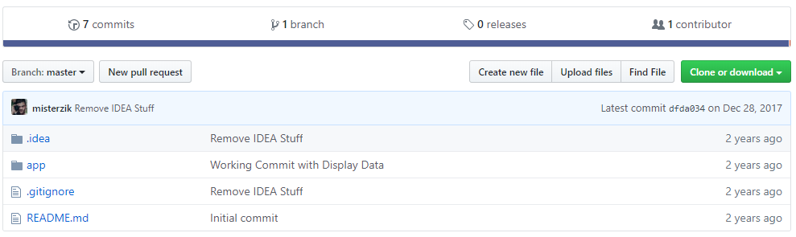

# Magento-deliverytracker

### Behind the scenes

It's mid 2017, A new request comes in for a basic magento 1.x/2 module, this module injects a new table inside magento db, and allows you to track changes on it. Unfortunately i cannot show the backend work, but if you would have a db with tracking system data, this will fetch from ...

### Legacy Dependencies :

1) PHP
2) XML
3) Magento

### History Snapshot:

so why snapshot's? in order to be able to make all this public, there is a lot of clean up to do specially with some of this old deprecated code and private tokens, so in order for me to do that i've to erase all commits for all our script kiddies out there.

